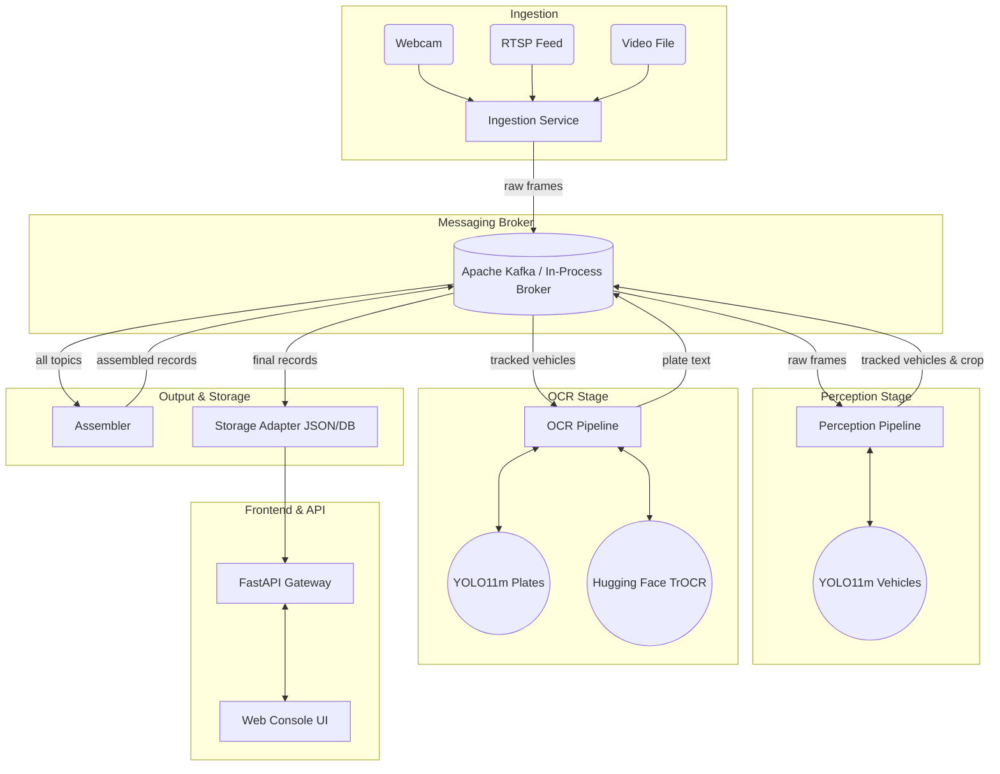

# ANPR Platform Architecture

This document describes the complete architecture of the Automatic Number Plate Recognition (ANPR) platform. The system is designed as an event-driven, staged processing pipeline built around Apache Kafka, utilizing state-of-the-art computer vision models (YOLO11m and PaddleOCR) to identify vehicles and their license plates across multiple camera feeds.

## High-Level Overview

The system captures video streams, detects and tracks vehicles, crops the images, detects license plates on those crops, performs Optical Character Recognition (OCR), and finally assembles the results. The data flows asynchronously through Kafka topics between isolated processing stages.



---

## Component Breakdown

### 1. Ingestion Layer (`src/anpr/ingestion`)
Responsible for reading frames from various sources (webcams, pre-recorded video files, or live RTSP streams). 
- **Workers**: A background worker runs for each camera defined in `configs/cameras.yaml`.
- **Action**: Extracts frames at the configured FPS, annotates them with metadata (camera ID, timestamp), and publishes them.
- **Output Topic**: `anpr.frames.raw`

### 2. Messaging Broker (`src/anpr/kafka`)
Acts as the central nervous system of the application, decoupling the ML processing stages.
- **Primary**: Apache Kafka (configured via `docker-compose.yml`).
- **Topics**:
  - `anpr.frames.raw`: Unprocessed camera frames.
  - `anpr.vehicles.tracked`: Detected vehicles, bounding boxes, speed, color, and cropped images.
  - `anpr.plates.ocr`: Extracted plate text.
  - `anpr.records.final`: Aggregated and finalized ANPR records.
  - `anpr.deadletter`: For messages that fail processing.
- **Fallback**: Includes an in-process broker implementation if the external Kafka container is down, ensuring the platform can still run seamlessly on a local machine.

### 3. Perception Stage (`src/anpr/perception`)
Focuses on the full scene to find and track vehicles.
- **Vehicle Detector (`vehicle_detector.py`)**: Uses the **YOLO11m** model (`yolo11m.pt`) configured for COCO classes (car, motorcycle, bus, truck) to locate vehicles.
- **Tracker (`tracker.py`)**: Tracks objects across consecutive frames to maintain a stable `track_id` and calculates speed based on pixel displacement (using the `calibration.meters_per_pixel` configuration).
- **Color Classifier (`color_classifier.py`)**: Estimates the primary color of the tracked vehicle.
- **Cropper (`cropper.py`)**: Extracts just the bounding box of the vehicle from the larger frame to improve downstream efficiency.
- **Output Topic**: `anpr.vehicles.tracked`

### 4. OCR Stage (`src/anpr/ocr`)
Focuses specifically on the cropped vehicle image to find and read the license plate. By not searching the full frame, accuracy and performance are vastly improved.
- **Plate Detector (`plate_detector.py`)**: Uses local **YOLO11m** plate weights (`data/models/yolo11m_plate.pt`) when present; otherwise falls back to a heuristic crop detector.
- **TrOCR Reader (`trocr_reader.py`)**: Crops the license plate from the vehicle image and passes it to Hugging Face's **TrOCR** (`microsoft/trocr-small-printed`), a transformer-based model optimized for printed text recognition.
- **Output Topic**: `anpr.plates.ocr`

### 5. Assembler & Pipeline (`src/anpr/pipeline`)
Stitches the asynchronous pieces back together.
- **Assembler (`assembler.py`)**: Listens to the perception and OCR topics. When it receives a plate text event, it joins it with the corresponding vehicle tracking event (matching by `camera_id` and `track_id`) into a unified final record.
- **Output Topic**: `anpr.records.final`

### 6. Storage & Persistence (`src/anpr/storage`)
Handles saving the processed data. Currently utilizes JSON, but structured to allow swapping in a SQL/NoSQL database seamlessly.
- **Files**:
  - `data/json/anpr_records.jsonl`: Append-only stream of all finalized records.
  - `data/json/pipeline_events.jsonl`: Audit log of pipeline steps.
  - `data/json/latest_snapshot.json`: Contains the N most recent records, used for fast retrieval by the frontend.
  - `data/crops/`: Saves the physical images of the cropped vehicles and plates.

### 7. API Gateway (`src/anpr/api`)
A **FastAPI** web server that provides the interface between the backend processing and the user interface.
- **REST Endpoints**: `/api/cameras`, `/api/snapshot`, `/api/records` for fetching historical and configuration data.
- **Live Streams**: `/api/stream/{camera_id}.jpg` uses a multipart JPEG stream to provide live low-latency video to the UI.
- **WebSockets**: `/ws/live` pushes live recognition events to connected clients instantly.

### 8. Frontend (`frontend/`)
A vanilla HTML/JS/CSS single-page application.
- Features a live operations console.
- Displays live video streams, an interactive site map, and a real-time table of identified vehicles and plates.

---

## Directory Layout

```text
├── configs/             # YAML configurations for cameras, Kafka ACLs, and models
├── src/anpr/
│   ├── api/             # FastAPI server and endpoints
│   ├── core/            # Common configs, paths, and utilities
│   ├── ingestion/       # Video source ingestion (Webcam, RTSP, File)
│   ├── kafka/           # Kafka Producer/Consumer and in-process fallback
│   ├── ocr/             # License plate detection and TrOCR text recognition
│   ├── perception/      # Vehicle detection, tracking, speed, and color
│   ├── pipeline/        # Stage runners and the final record Assembler
│   ├── storage/         # JSONL handlers and filesystem cropping
│   └── viz/             # Visualizations (bounding boxes, overlays)
├── frontend/            # Vanilla HTML/JS/CSS Web Console
├── data/
│   ├── json/            # Output databases (JSONL and snapshots)
│   ├── crops/           # Saved images of vehicles and plates
│   └── videos/          # Source video files
├── scripts/             # Setup and run scripts (e.g., download_models.py)
├── pyproject.toml       # Python package definition
└── requirements.txt     # Python dependencies
```
